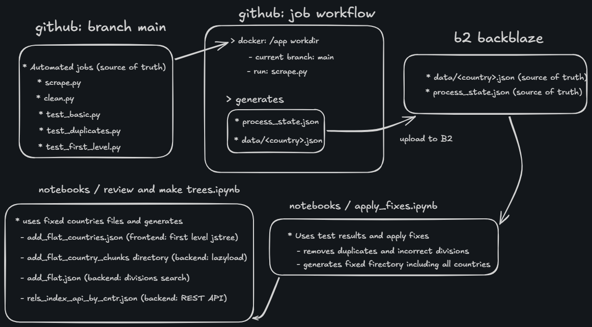

# Data scraping, cleaning and testing OpenStreeMap administrative divisions

## Automated jobs are done in a github workflow.
  * That includes 5 task: scrape, clean, test basic, test first level, test duplicates
  * Each task is presumable through a state file
  * Data is uploaded to b2 backblaze and is the source of truth

## Data workflow schema

*Data workflow schema*

## tech stack: python, pandas, numpy, github actions, b2 backblaze